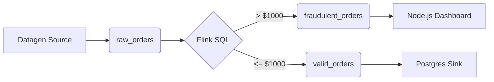

# FraudOps Pipeline

A real-time e-commerce fraud prevention pipeline built on Confluent Cloud.

## Architecture

Data flows from a simulated order stream into Kafka, gets processed by Flink SQL in real-time to detect anomalies, and splits into two streams: one for a live dashboard (fraud alerts) and one for a Postgres database (valid orders).



## Running the Dashboard

You need a `.env` file in the `dashboard` folder with your Confluent API keys. See `.env.example` for the required variables.

```bash
cd dashboard
npm install
npm start
```
App will be running on `http://localhost:3000`.

## Confluent Setup

If you want to recreate the cloud resources, the configurations are in the `confluent_cloud` folder:
- `01_schema_v1.avsc` - The Avro schema for the `raw_orders` topic.
- `02_datagen_source.json` - Config for the Datagen Source connector.
- `03_ksqldb_processing.sql` - The Flink SQL statements used to split the streams.
- `04_postgres_sink.json` - Config for the downstream database.
